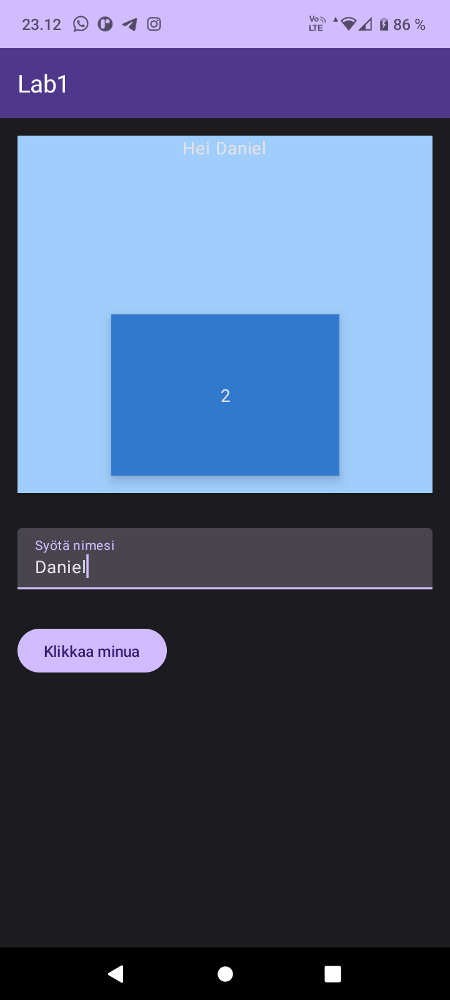

# HelloWorld2 Android App

HelloWorld2 is a simple Android app created using Android Studio that displays "Hello World" and "2" strings in separate overlapping views, along with a button at the bottom of the display. The app also supports translation into at least two languages (e.g., English and Finnish).

## Table of Contents

- [Introduction](#introduction)
- [Phase 1](#phase-1)
- [Phase 2](#phase-2)
- [Phase 3](#phase-3)
- [Rotating Device Behavior](#rotating-device-behavior)
- [Usage](#usage)
- [Contributing](#contributing)
- [License](#license)

## Introduction

This Android app project was created as part of a lab exercise. It demonstrates the following features:

- Displaying "Hello World" and "2" strings in separate overlapping views.
- Adding a button at the bottom of the display.
- Utilizing UI components like `Column`, `Box`, and `Scaffold`.
- Applying elevation shadows with different depths to text elements.
- Defining custom colors in a separate Kotlin file.
- Supporting translation into multiple languages (e.g., English and Finnish).

## Phase 1

In Phase 1, we created the basic structure of the app with the following components:

- Two overlapping text views displaying "Hello World" and "2".
- A button at the bottom of the screen.
- Utilized various UI components for layout.
- Implemented elevation shadows for text elements.
- Defined custom colors for the app.

## Phase 2

Phase 2 added interactivity to the app by implementing an `onClick` listener for the button. The behavior is as follows:

- When the button is clicked, the "Hello World" text changes to "Goodbye Darkness."
- On the next click, the text reverts to "Hello World."

## Phase 3

In Phase 3, additional functionality was added to the app:

- A `TextField` was introduced to input a name.
- When the "Click me" button is pressed:
  - If the `TextField` is not empty, a customized hello message like "Hello John!" is displayed, where "John" corresponds to the value entered in the `TextField`, and the `TextField` is cleared.
  - If the `TextField` is empty, the app toggles between "Hello World" and "Goodbye Darkness."

## Rotating Device Behavior

If you rotate your phone from portrait to landscape (in Auto-rotate mode) with the "Goodbye Darkness" message displayed, the default behavior is that the app restarts and returns to the initial state ("Hello World" and "2" displayed).

## Usage

To use this app, follow these steps:

1. Clone the repository to your local machine.
2. Open the project in Android Studio.
3. Build and run the app on an Android emulator or a physical device.
4. Interact with the app using the provided button and text input field.

## Screenshots

## References

- Vuori, J, Hjort, P 2023, ‘w1_d5_Recap_DevTools_ComposeUI’, TX00CK66 Sensor Based Mobile Applications, viewed 01 September 2023, https://github.com/datpt98/sensor-based-mobile-applications/blob/main/Lab1/Lab01.pdf.
