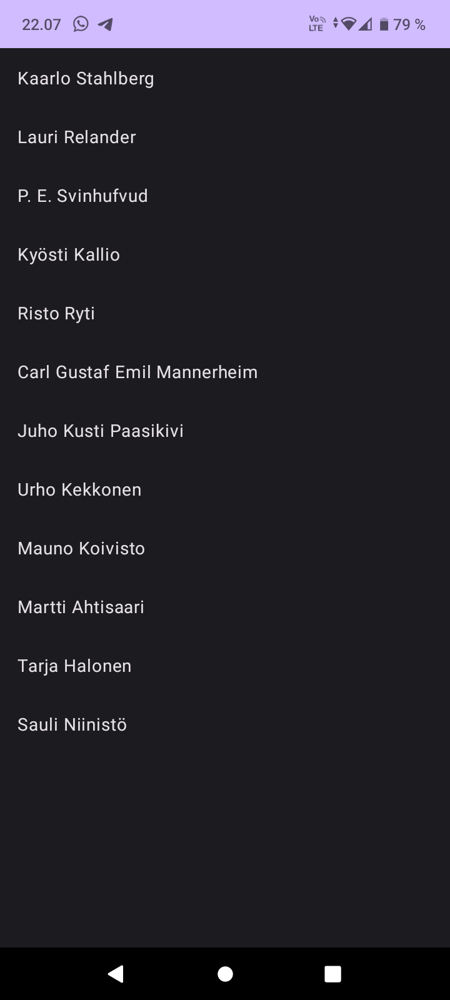
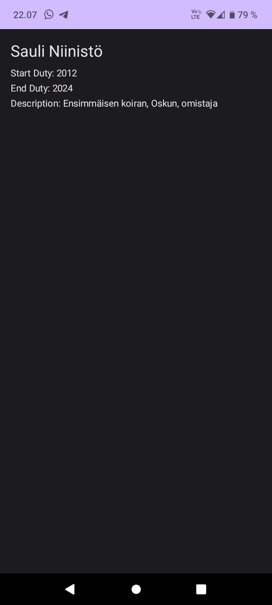

# Presidents List Android App

This Android application allows users to view a list of presidents. By tapping on a president's name in the list, a detailed view with information such as the name, start duty, end duty, and description of that president is displayed on a new screen. You can choose to implement this exercise using either JetPack Compose or RecyclerView and Fragments.

## Table of Contents

- [Introduction](#introduction)
- [JetPack Compose Implementation](#jetpack-compose-implementation)
- [RecyclerView and Fragment Implementation](#recyclerview-and-fragment-implementation)
- [Usage](#usage)
- [Contributing](#contributing)
- [License](#license)

## Introduction

This Android app project was created as part of a lab exercise for the course "Sensor Based Mobile Applications" (TX00CK66) at METROPOLIA University of Applied Sciences. The exercise aims to demonstrate the following concepts:

- Displaying a list of presidents.
- Navigating between different screens.
- Using JetPack Compose or RecyclerView and Fragments for UI implementation.
- Passing data between components.
- Managing backstack for fragments.

## JetPack Compose Implementation

In the JetPack Compose implementation, we utilize the `navController` for seamless navigation between two separate composables: the list of presidents and the detailed view. The following hints may be useful for this implementation:

- To use JetPack Compose navigation, ensure you add the `androidx.navigation:navigation-compose` dependency to your module's build.gradle file.

- Pass strings as parameters between composables and use the `find` method to find the matching object from the ArrayList.

## RecyclerView and Fragment Implementation

In the RecyclerView and Fragment implementation, we create a simple RecyclerView to display the list of presidents. The list of presidents should be in one fragment, and detailed presidential information is shown on a second fragment. Here are some hints for this implementation:

- Use the AndroidX Fragment library for fragment management. Add the necessary dependency to your module's build.gradle file.

- Utilize a FragmentContainerView in your main layout to contain the place for the fragment.

- Communication between fragments can be achieved using Bundles. Pass data like the index of the selected president using a key (e.g., "pos").

- Control user selections through the MainActivity by implementing an interface in the Fragment to inform the MainActivity when a button is clicked.

- Use the constructor to pass parameters to the fragment.

## Usage

To use this app, follow these steps:

1. Clone the repository to your local machine.

2. Open the project in Android Studio.

3. Build and run the app on an Android emulator or a physical device.

4. Interact with the app by tapping on a president's name to view their details.

## Screenshots

## References

- Vuori, J, Hjort, P 2023, ‘w1_d5_ComposeList’, TX00CK66 Sensor Based Mobile Applications, viewed 01 September 2023, https://github.com/datpt98/sensor-based-mobile-applications/blob/main/Lab2/Lab02.pdf.
