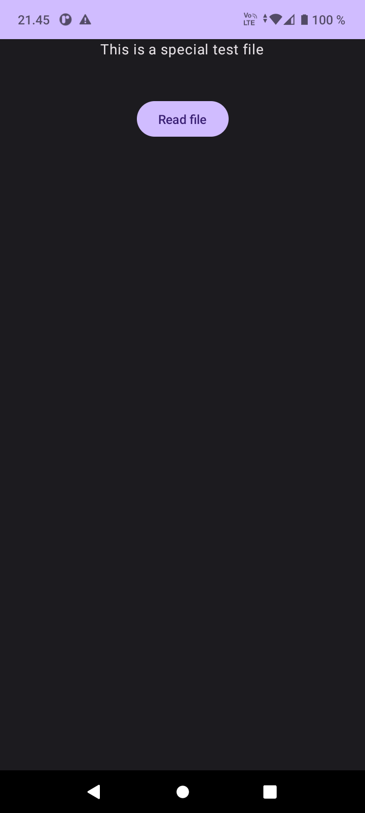

# Web Text Downloader Android App

This Android application allows users to download a text file from the web and display its contents in a Composable Text. The app uses a separate thread for communication to ensure smooth performance. Here's how you can create this app:

## Table of Contents

- [Introduction](#introduction)
- [Getting Started](#getting-started)
- [Usage](#usage)
- [Network Inspector](#network-inspector)
- [Permissions](#permissions)
- [Screenshots](#screenshots)
- [License](#license)

## Introduction

This Android app project was created as part of a lab exercise for the course "Networking with Threads (Handler)" at [Your University's Name]. The exercise aims to demonstrate the following concepts:

- Downloading data from the web using a separate thread.
- Displaying the downloaded content in a Composable Text.
- Handling network communication efficiently with threads and a Handler.

## Getting Started

To create this app, follow these steps:

1. Create a new Android project in Android Studio.

2. Implement a separate thread for network communication. You can use the provided hint to request data from a specific data source (e.g., https://users.metropolia.fi/~jarkkov/koe.txt).

3. Display the downloaded content in a Composable Text view.

4. Test the app by running it on an Android emulator or a physical device.

## Usage

To use this app, follow these steps:

1. Launch the app on your Android device.

2. The app will initiate a network request to download the text file from the specified data source.

3. Once the download is complete, the contents of the text file will be displayed in a Composable Text view within the app.

4. You can scroll through and read the downloaded text content.

## Network Inspector

For debugging purposes and to monitor the communication between your application and the server, you can use Network Inspector. It can be activated while the application is running (either on your phone or on the emulator) by clicking the App Inspection name on the bottom menu/icon line. By selecting a time scale on the Network graph, you can see the query and response in clear text.

## Permissions

Ensure that you have the required permissions for internet communication in the AndroidManifest.xml file. You can add the following lines to your manifest file:

```xml
<uses-permission android:name="android.permission.INTERNET" />
<uses-permission android:name="android.permission.ACCESS_NETWORK_STATE" />

## Screenshots

<div>

</div>

## References

- Vuori, J, Hjort, P 2023, w2_d4_NetworkingAndThreads, TX00CK66 Sensor Based Mobile Applications, viewed 10 September 2023, https://github.com/datpt98/sensor-based-mobile-applications/blob/main/Lab3/Lab03.pdf.
