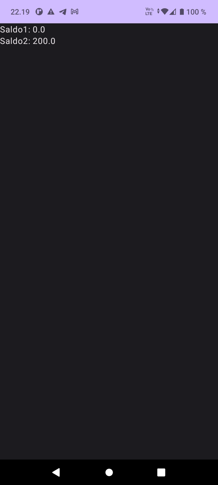

# Coroutine Bank App

This Android application demonstrates the use of coroutines to fix a program with concurrency issues. The program contains two cooperating coroutines, and the goal is to correct the code so that the final saldo of the account will be 200. The original code has issues where the final saldo may be incorrect.

## Table of Contents

- [Introduction](#introduction)
- [Getting Started](#getting-started)
- [Usage](#usage)
- [Fixing the Issues](#fixing-the-issues)
- [Hints](#hints)
- [Screenshots](#screenshots)
- [References](#references)

## Introduction

The exercise focuses on using coroutines in Kotlin to address concurrency issues and ensure the correct execution of code.

## Getting Started

To get started with this exercise:

1. Review the provided code in the `MainActivity` class, which contains two coroutines for depositing money into an account.

2. Understand the problem: The code as it stands has concurrency issues, and the final saldo of the account may not be as expected.

## Usage

To use this app, follow these steps:

1. Open the provided code in your preferred IDE or code editor.

2. Analyze the code and identify the concurrency issues that need to be fixed.

3. Implement the necessary corrections to ensure that the final saldo of the account is 200 while still using the two independent coroutines.

4. Test the app by running it on an Android emulator or a physical device.

## Fixing the Issues

To fix the program and ensure that the final saldo of the account is 200, you need to address the concurrency issues present in the code. There are two separate errors that need to be corrected, and you should not use `withContext()` in your solution.

### Hints

- There are two main issues in the program that need to be fixed to ensure the correct final saldo.

- The `Mutex` may be a useful tool to help address the concurrency issues and synchronize access to the account's balance.

## Screenshots

## References

- Vuori, J, Hjort, P 2023, w2_d5_Coroutine, TX00CK66 Sensor Based Mobile Applications, viewed 10 September 2023, https://github.com/datpt98/sensor-based-mobile-applications/blob/main/Lab4/Lab04.pdf.
