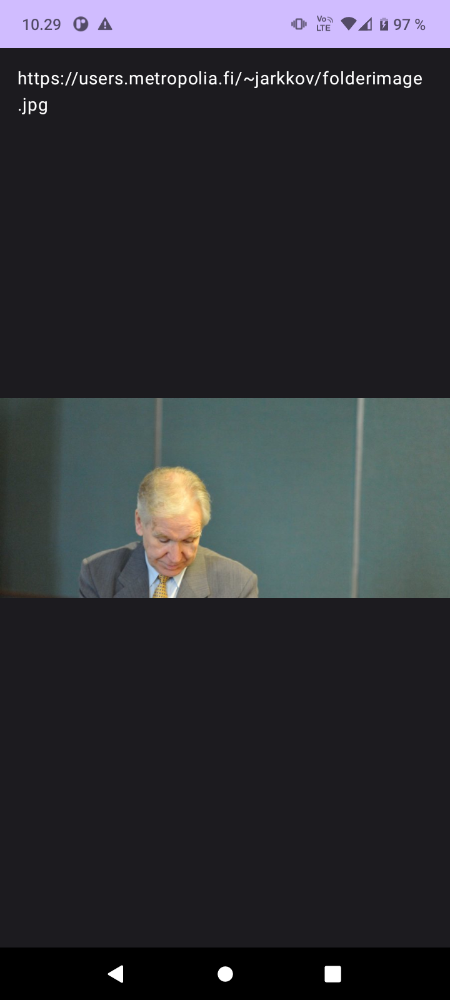

# Image Downloader Android App

This Android application allows users to download an image from the web and display it in an Image composable. The app uses coroutines for efficient network communication and image handling. Here's how you can create this app:

## Table of Contents

- [Introduction](#introduction)
- [Getting Started](#getting-started)
- [Usage](#usage)
- [Network Inspector](#network-inspector)
- [Permissions](#permissions)
- [Dependencies](#dependencies)
- [Screenshots](#screenshots)
- [References](#references)

## Introduction

The exercise focuses on using coroutines in Kotlin to download an image from the web and display it using the Android Compose library.

## Getting Started

To get started with this exercise:

1. Review the provided code and hints for downloading an image from the web.

2. Understand the use of coroutines for asynchronous network communication and the `BitmapFactory.decodeStream()` function for decoding an input stream into a Bitmap.

## Usage

To use this app, follow these steps:

1. Open the provided code in your preferred IDE or code editor.

2. Implement the necessary code to download an image from a web URL and decode it into a Bitmap.

3. Display the downloaded image in an Image composable.

4. Test the app by running it on an Android emulator or a physical device.

## Network Inspector

For debugging purposes and to monitor the communication between your application and the server, you can use App Inspector. It can be activated while the application is running (either on your phone or on the emulator) by clicking the App Inspector name on the bottom menu/icon line. By selecting a time scale on the Network graph, you can see the query and response in clear text.

## Permissions

Ensure that you have the required permissions for internet communication in the AndroidManifest.xml file. You can add the following lines to your manifest file:

```xml
<uses-permission android:name="android.permission.INTERNET" />
<uses-permission android:name="android.permission.ACCESS_NETWORK_STATE" />
```

## Dependencies
If you want to use lifecycleScope, ensure that you have the following dependency in your module's build.gradle file:

```gradle
implementation 'androidx.lifecycle:lifecycle-runtime-ktx:2.4.0'
```

This allows you to use lifecycleScope for coroutine handling related to the Android Lifecycle.

## Screenshots

<div>

</div>

## References

- Vuori, J, Hjort, P 2023, w2_d5_CouroutinesNet, TX00CK66 Sensor Based Mobile Applications, viewed 10 September 2023, https://github.com/datpt98/sensor-based-mobile-applications/blob/main/Lab4b/Lab04b.pdf.
