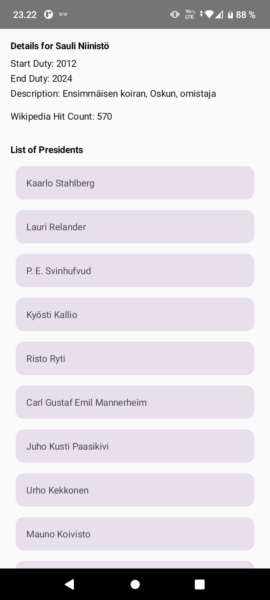

# Wikipedia President Info Android App

This Android application allows users to view a list of presidents and retrieve information about the number of links to their Wikipedia web pages using the Wikipedia web service API. The app uses Retrofit for network communication and LiveData & ViewModel to manage data.

## Table of Contents

- [Introduction](#introduction)
- [Getting Started](#getting-started)
- [Usage](#usage)
- [Network Inspector](#network-inspector)
- [Permissions](#permissions)
- [Dependencies](#dependencies)
- [ViewModel](#viewmodel)
- [Screenshots](#screenshots)
- [References](#references)

## Introduction

The exercise focuses on using Retrofit, LiveData, and ViewModel in Kotlin to fetch data from the Wikipedia web service API and display it in your Android application.

## Getting Started

To get started with this exercise:

1. Review the provided hints for querying the Wikipedia API, setting up Retrofit, and using LiveData & ViewModel.

2. Understand how to query the API to fetch information about the number of links to a president's Wikipedia web page.

3. Set up your Android project and create the necessary components, such as the ViewModel, LiveData, and Retrofit service.

## Usage

To use this app, follow these steps:

1. Open the provided code in your preferred IDE or code editor.

2. Implement the necessary code to fetch the list of presidents and display them in your app.

3. When a user clicks on a president's name, retrieve information about the number of links to their Wikipedia web page and display it in your app.

4. Test the app by running it on an Android emulator or a physical device.

## Network Inspector

For debugging purposes and to monitor the communication between your application and the Wikipedia server, you can use App Inspector. It can be activated while the application is running (either on your phone or on the emulator) by clicking the App Inspector name on the bottom menu/icon line. By selecting a time scale on the Network graph, you can see the query and response in clear text.

## Permissions

Ensure that you have the required permission for internet communication in the AndroidManifest.xml file. You can add the following line to your manifest file:

```xml
<uses-permission android:name="android.permission.INTERNET" />
```

## Dependencies
Make sure to include the following Retrofit library references in your build.gradle (Module) dependencies block:

```gradle
final retrofit_version = '2.9.0'
implementation "com.squareup.retrofit2:retrofit:$retrofit_version"
implementation "com.squareup.retrofit2:converter-gson:$retrofit_version"
```

## ViewModel
The provided ViewModel class, `MyViewModel`, can be useful for managing data and fetching hit counts from the Wikipedia API. The ViewModel uses LiveData to update the UI based on the response from the API.

```kotlin
class MyViewModel : ViewModel() {
    private val repository: WikiRepository = WikiRepository()
    var wikiUiState: Int by mutableStateOf(0)
        private set

    fun getHits(name: String) {
        viewModelScope.launch(Dispatchers.IO) {
            val serverResp = repository.hitCountCheck(name)
            wikiUiState = serverResp.query.searchinfo.totalhits
        }
    }
}
```

You can use the `wikiUiState` property in your Composable function to update the UI based on the hit count retrieved from the API.

## Screenshots

<div>

</div>

## References

- Vuori, J, Hjort, P 2023, w3_d5_Retrofit, TX00CK66 Sensor Based Mobile Applications, viewed 16 September 2023, https://github.com/datpt98/sensor-based-mobile-applications/blob/main/Lab5/Lab5.pdf.

