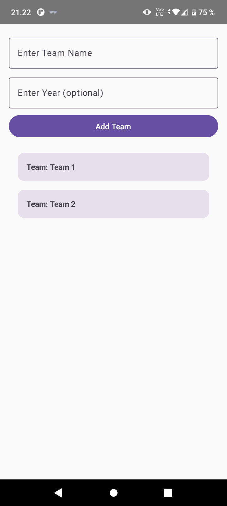
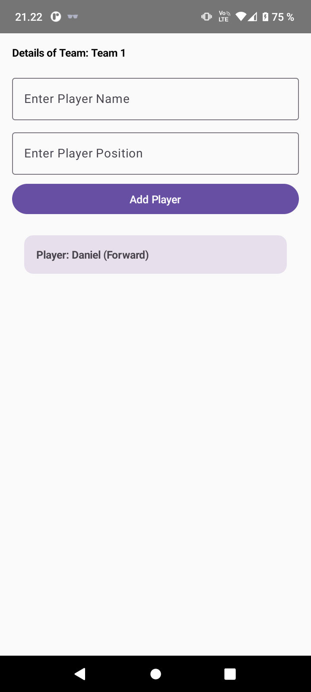

# Room Database Android App

This Android application demonstrates the use of Room, ViewModel, and LiveData to create a simple SQLite database with at least two related tables. The app allows users to insert data into the tables and view the content through a LazyColumn. Here's how you can create this app:

## Table of Contents

- [Introduction](#introduction)
- [Getting Started](#getting-started)
- [Usage](#usage)
- [Database Inspector](#database-inspector)
- [Clearing Cache](#clearing-cache)
- [Database Entities](#database-entities)
- [Views and Composables](#views-and-composables)
- [Screenshots](#screenshots)
- [References](#references)

## Introduction

The exercise focuses on using Room, ViewModel, and LiveData in Kotlin to create and manage a SQLite database with related tables.

## Getting Started

To get started with this exercise:

1. Review the provided code and hints for creating a Room database with at least two related tables.

2. Understand the use of ViewModel and LiveData for handling data between the database and UI components.

3. Set up your Android project and create the necessary components, including database entities, DAOs, ViewModel, and views.

## Usage

To use this app, follow these steps:

1. Open the provided code in your preferred IDE or code editor.

2. Implement the necessary code to create the SQLite database with at least two related tables (e.g., football teams and players).

3. Create views to insert data into each table (e.g., team names and player names/positions).

4. Implement a LazyColumn to list the content from the related tables, showing the relationship between teams and players.

5. Test the app by running it on an Android emulator or a physical device.

## Database Inspector

For debugging purposes and to inspect the database, you can use the Database Inspector in Android Studio. It allows you to view the database's structure, tables, and data, helping you troubleshoot any database-related issues.

## Clearing Cache

When modifying the database (entities, DAO, etc.), before redeploying your app to the emulator or debugging device, go to your phone's settings:

1. App & notification.
2. Select your app.
3. Navigate to Storage & cache.
4. Clear both cache and storage.

This step ensures that you avoid database modification exceptions when deploying the updated app.

## Database Entities

Define your database entities based on your use case. For example, if you are creating a database for football teams and players, you might have entities for `TeamEntity` and `PlayerEntity`. Ensure that you define the relationships between these entities using appropriate annotations.

## Views and Composables

Create user-friendly views and composables for inserting data into your database tables and displaying the content. You can use Compose UI elements to design your app's user interface.

## Screenshots

## References

- Vuori, J, Hjort, P 2023, w3_d1_Room, TX00CK66 Sensor Based Mobile Applications, viewed 23 September 2023, https://github.com/datpt98/sensor-based-mobile-applications/blob/main/Lab5a/Lab05a.pdf.
