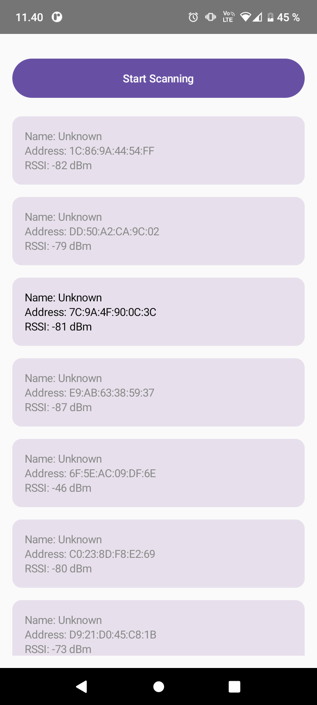

# Bluetooth LE Device Scanner Android App

This Android application allows users to scan for Bluetooth Low Energy (BLE) devices around their phone and display a list of discovered devices. The list includes device names (if available), MAC addresses, and received signal strength indicator (RSSI) values. If a device cannot be connected to (e.g., it's a beacon or a device without access), the corresponding entry in the list is grayed out.

## Table of Contents

- [Introduction](#introduction)
- [Getting Started](#getting-started)
- [Usage](#usage)
- [Permissions](#permissions)
- [UI Elements](#ui-elements)
- [Professional Scanners](#professional-scanners)
- [Emulator and Testing](#emulator-and-testing)
- [Screenshots](#screenshots)
- [References](#references)

## Introduction

This lab exercise is part of the course [Your Course Name] at [Your University's Name]. The exercise focuses on practicing Bluetooth Low Energy (BLE) communication in Android and demonstrates basic BLE scanning operations.

## Getting Started

To get started with this exercise:

1. Review the provided code and hints for scanning BLE devices using Android's Bluetooth LE API.

2. Understand the use of permissions and runtime permission checks required for Bluetooth LE scanning.

3. Create the necessary UI components and logic for scanning and displaying discovered devices.

## Usage

To use this app, follow these steps:

1. Open the provided code in your preferred IDE or code editor.

2. Ensure that your AndroidManifest.xml file includes all three static permissions required for Bluetooth LE:
   - `android.permission.BLUETOOTH`
   - `android.permission.BLUETOOTH_ADMIN`
   - `android.permission.BLUETOOTH_SCAN`

3. Implement runtime permission checks to ensure that these permissions are granted by the user before starting scanning.

4. Add a button to your app's UI to initiate the scanning process.

5. After approximately 3 seconds (or as desired), stop the scanning process and display the results in a list.

## Permissions

To use Bluetooth LE features, you need to declare the following permissions in your AndroidManifest.xml file:

```xml
<uses-permission android:name="android.permission.BLUETOOTH" />
<uses-permission android:name="android.permission.BLUETOOTH_ADMIN" />
<uses-permission android:name="android.permission.BLUETOOTH_SCAN" />
```

Ensure that you also request and check these permissions at runtime to ensure that your app can access Bluetooth functionality.

## UI Elements
In the UI, you can control the appearance of list entries based on whether a device is connectable or not. You can use the `color` attribute to set the text color accordingly.

## Professional Scanners
To understand the types of BLE devices around you and simulate various scenarios, you can use professional BLE scanner apps available on the Google Play Store. Examples include "BLE Scanner" and "nRF Connect." These apps provide insights into the available BLE devices and their characteristics.

## Emulator and Testing
You can use the Android Studio emulator, which simulates two BLE devices with the addresses `BE:AC:10:00:00:01` and `BE:AC:10:00:00:02`. This allows you to test your Bluetooth scanning application without physical BLE devices.

## Screenshots

<div>

</div>

## References

- Vuori, J, Hjort, P 2023, w3_d5_Beacon, TX00CK66 Sensor Based Mobile Applications, viewed 23 September 2023, https://github.com/datpt98/sensor-based-mobile-applications/blob/main/Lab6/Lab06.pdf.
