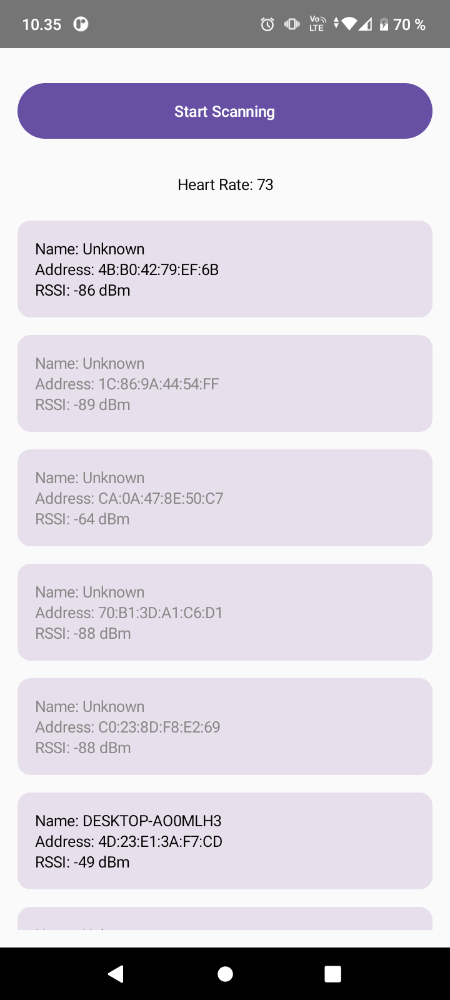

# Bluetooth LE Heart Rate Monitor Android App

This Android application allows users to connect to a Bluetooth Low Energy (BLE) device that provides a Heart Rate Service. Once a connection is established, the application enables notifications from the Heart Rate Service and displays heart rate data on the screen.

## Table of Contents

- [Introduction](#introduction)
- [Getting Started](#getting-started)
- [Usage](#usage)
- [Simulating BLE Devices](#simulating-ble-devices)
- [BLE Scanner App](#ble-scanner-app)
- [Notifications](#notifications)
- [LiveData for Data Transfer](#livedata-for-data-transfer)
- [Characteristics Specification](#characteristics-specification)
- [Screenshots](#screenshots)
- [References](#references)

## Introduction

The exercise focuses on establishing a connection with a BLE device that provides a Heart Rate Service and demonstrating the reception and display of heart rate data on an Android app.

## Getting Started

To get started with this exercise:

1. Review the provided code and hints for establishing a connection with a BLE device and enabling Heart Rate Service notifications.

2. Understand the use of the BluetoothGatt API for BLE communication.

3. Set up your Android project and create the necessary components for scanning and connecting to BLE devices.

## Usage

To use this app, follow these steps:

1. Open the provided code in your preferred IDE or code editor.

2. Ensure that your AndroidManifest.xml file includes the necessary permissions for Bluetooth communication.

3. Implement scanning for available BLE devices in your main activity, as you did in the previous exercise.

4. Select the desired BLE device from the list of available devices.

5. Establish a connection with the selected BLE device.

6. Enable notifications for the Heart Rate Service by writing `ENABLE_NOTIFICATION_VALUE` to the `CLIENT_CHARACTERISTIC_CONFIG_UUID` descriptor.

7. Once notifications are enabled, the app will start receiving heart rate data from the device and display it on the screen.

## Simulating BLE Devices

To test the app without physical BLE devices, you can use virtual BLE peripherals on different platforms:

### Windows:
- Microsoft Windows 10 (version 1803 and later) supports Bluetooth Peripheral emulation. You can use the "Bluetooth LE Explorer" application to simulate various GATT profiles as a peripheral, including the Heart Rate Service.

### MacOS:
- For MacOS, you can use the "LightBlue" application to create virtual Bluetooth peripherals.

## BLE Scanner App

For detecting nearby BLE devices and checking their profiles, you can install the "BLE Scanner" application from the Android Play Store.

## Notifications

Enabling notifications for the Heart Rate Service is crucial for receiving heart rate data. Ensure that you write the `ENABLE_NOTIFICATION_VALUE` to the `CLIENT_CHARACTERISTIC_CONFIG_UUID` descriptor.

## LiveData for Data Transfer

To transfer heart rate data from the ViewModel to the UI, you can use LiveData. For example:

```kotlin
val mBPM = MutableLiveData<Int>(0)

override fun onCharacteristicChanged(gatt: BluetoothGatt, characteristic: BluetoothGattCharacteristic) {
    val bpm = characteristic.getIntValue(BluetoothGattCharacteristic.FORMAT_UINT16, 1)
    Log.d("DBG", "BPM: $bpm")
    mBPM.postValue(bpm)
}
```

## Characteristics Specification
The heart rate measurement characteristic data value is specified in the [Bluetooth GATT Characteristics Specification](https://www.bluetooth.com/wp-content/uploads/Sitecore-Media-Library/Gatt/Xml/Characteristics/org.bluetooth.characteristic.heart_rate_measurement.xml).

## Screenshots

<div>

</div>

## References

- Vuori, J, Hjort, P 2023, w4_d5_Bluetooth, TX00CK66 Sensor Based Mobile Applications, viewed 25 September 2023, https://github.com/datpt98/sensor-based-mobile-applications/blob/main/Lab7/Lab07.pdf.

