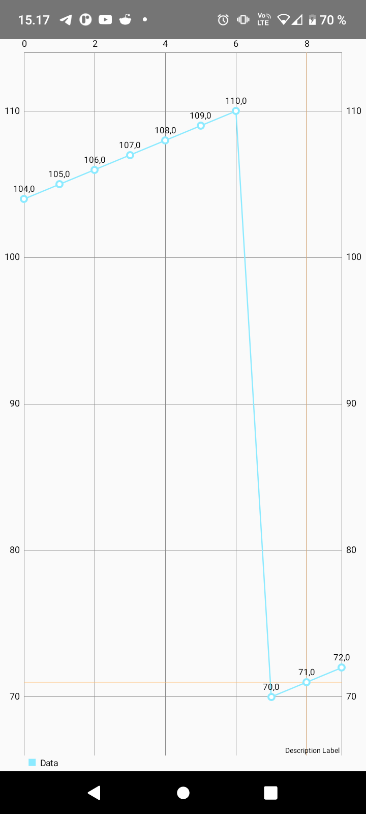
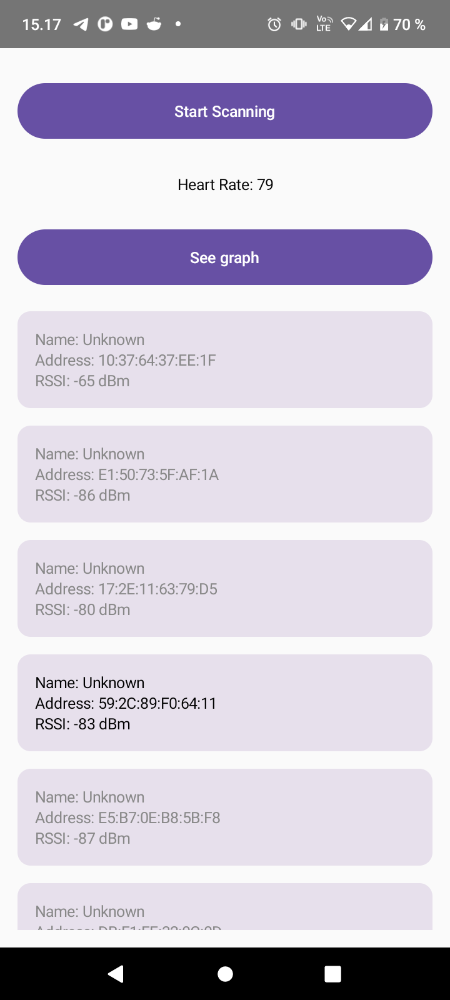

# Heart Rate Measurement Graph Android App

This Android application allows users to collect and visualize Heart Rate measurement values as a graph. Users can select a Bluetooth device by its address to establish a connection, and the app will continuously display Heart Rate measurements. By clicking on a measurement value, users can view a graph displaying the measurements over time.

## Table of Contents

- [Introduction](#introduction)
- [Getting Started](#getting-started)
- [Usage](#usage)
- [Data Collection](#data-collection)
- [Passing Data with ViewModel](#passing-data-with-viewmodel)
- [Graph Library](#graph-library)
- [Alternative Data Sources](#alternative-data-sources)
- [Screenshots](#screenshots)
- [References](#references)

## Introduction

The exercise focuses on collecting Heart Rate measurements from a connected Bluetooth device and visualizing them as a graph within an Android app.

## Getting Started

To get started with this exercise:

1. Review the provided code and hints for collecting Heart Rate measurements and displaying them as a graph.

2. Understand the use of the ViewModel architecture component for data management and Composable functions for UI rendering.

3. Set up your Android project and create the necessary components for Bluetooth device selection, data collection, and graph visualization.

## Usage

To use this app, follow these steps:

1. Open the provided code in your preferred IDE or code editor.

2. Ensure that your AndroidManifest.xml file includes the necessary permissions for Bluetooth communication.

3. Launch the app and select a Bluetooth device by entering its address or using a device discovery process.

4. Once connected, the app will continuously collect Heart Rate measurements from the selected device.

5. Click on a specific measurement value to view a graph displaying the measurements over time.

## Data Collection

Collect Heart Rate measurements from the `onCharacteristicChanged()` function and store them in a list within the ViewModel.

## Passing Data with ViewModel

Pass the collected Heart Rate data between Composable functions by using the same ViewModel instance. This allows you to easily share data between different parts of your app.

## Graph Library

Choose a graph library to visualize the Heart Rate measurements. One option is to use MPAndroidChart, but you can use any graph library that suits your needs and preferences.

## Alternative Data Sources

If you don't have access to Heart Rate measurements, you can use alternative data sources, such as RSSI indicator values from the Bluetooth API or other types of data.

## Screenshots

## References

- Vuori, J, Hjort, P 2023, w4_d5_Graph, TX00CK66 Sensor Based Mobile Applications, viewed 26 September 2023, https://github.com/datpt98/sensor-based-mobile-applications/blob/main/Lab7/Lab07.pdf.